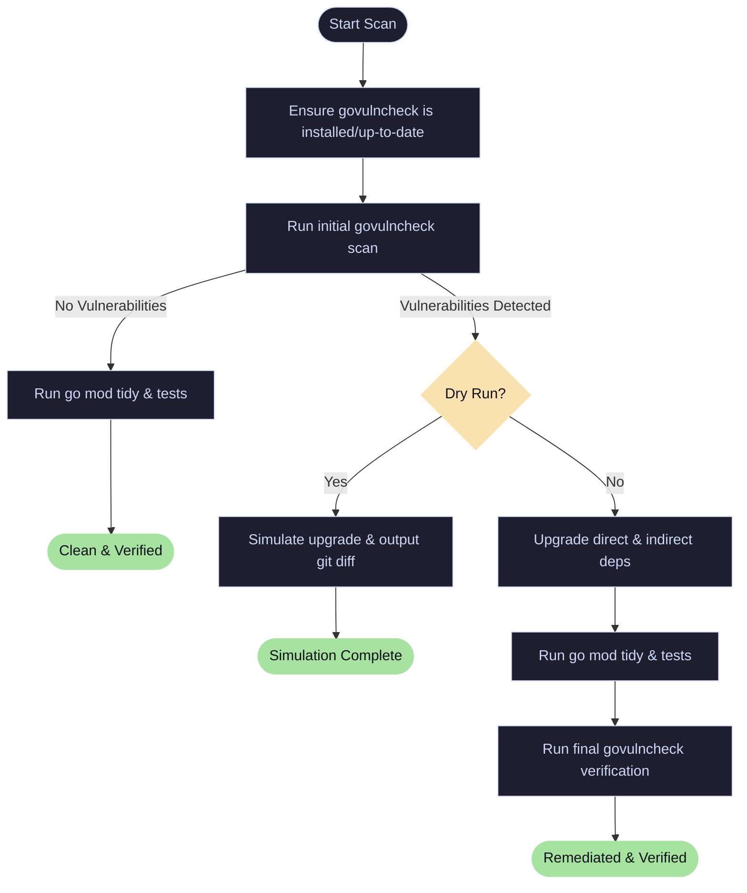

# 🛡️ SecureGoDeps

<p align="left">
  <a href="https://golang.org/"></a>
  <a href="https://pkg.go.dev/golang.org/x/vuln/cmd/govulncheck"></a>
  <a href="https://github.com/your-username/SecureGoDeps/actions"></a>
  <a href="https://opensource.org/licenses/MIT"></a>
</p>

`SecureGoDeps` is an automated security vulnerability scanner and dependency remediation tool for Go modules. It leverages Go's official `govulncheck` to analyze your codebase for reachable vulnerabilities, simulates or applies upgrades to affected packages, and validates repository stability through module tidying and unit testing.

---

## ⚠️ Dependency housekeeping WARNING

You nolonger have an excuse for deploying vulnerable Go dependecies in your code. This repo provides an easy to use CLI tool to scan and remediate vulnerabilties in your code.

---

## ⚡ How It Works



---

## 🚀 Key Features

*   **Automated Tooling Lifecycle**: Automatically installs or updates `govulncheck` to the latest version on each run.
*   **Vulnerability Detection**: Scans package patterns (`./...`) to identify reachable vulnerabilities that actually affect your compiled code.
*   **Smart Remediation**:
    *   If **vulnerable**: Upgrades packages (`go get -u`), runs tests (`go test`), and re-scans to verify remediation.
    *   If **healthy**: Runs standard sanity checks (`go mod tidy` & `go test`) to ensure everything compiles cleanly.
*   **Safe Simulation (Dry Run)**: Safely simulates dependency upgrades and prints a `git diff` format patch showing proposed changes without editing file state.

---

## 📦 Getting Started

### Prerequisites

- **Go** (version 1.18 or higher recommended; script automatically switches Go toolchains if needed).
- **Bash** environment.

### Installation

No heavy setup required. Copy or clone this utility to your project:

```bash
git clone https://github.com/your-username/SecureGoDeps.git
cd SecureGoDeps
```

---

## 🔧 Usage & CLI Reference

Run the script from the root of your Go module or provide a specific target path.

### Command Syntax

```bash
./scripts/secure-go-deps.sh [options]
```

### Options

| Flag | Long Option | Description |
| :--- | :--- | :--- |
| `-p` | `--path PATH` | Path to the Go project/module to scan. |
| `-d` | `--dry-run` | Preview the upgrades and show a `diff` without modifying files. |
| `-h` | `--help` | Show the help documentation. |

### Command Examples

**Scan current directory:**
```bash
./scripts/secure-go-deps.sh
```

**Perform a dry run to inspect changes:**
```bash
./scripts/secure-go-deps.sh --dry-run
```

**Scan a specific sub-project:**
```bash
./scripts/secure-go-deps.sh --path ./examples/testing
```

---

## 📝 Example Output

When a vulnerability is detected and automatically resolved:

```
==> Using project directory: /home/user/SecureGoDeps/examples/testing
==> Checking this is a Go module repo...
==> Installing/updating govulncheck...
==> Running initial vulnerability scan...
govulncheck: loading packages:
...
==> Vulnerabilities were found.
==> Attempting to upgrade all direct and indirect dependencies...
go: upgraded golang.org/x/text v0.35.0 => v0.38.0
==> Tidying module files...
==> Running tests after dependency upgrades...
ok      secure-go-deps  (cached)
==> Running final vulnerability scan...
No vulnerabilities found.

==> Done. Dependencies were upgraded, tests passed, and govulncheck passed.
```

---

## 🧪 Testing

A sample project for testing vulnerability scanning and automatic remediation is available in the `examples/testing` directory. See the [Examples README](examples/README.md) for usage and test execution instructions.

---

## 🛠️ CI/CD Integration

For details on integrating `SecureGoDeps` into your continuous integration workflows (e.g. GitHub Actions), please refer to the [Examples README](examples/README.md).
